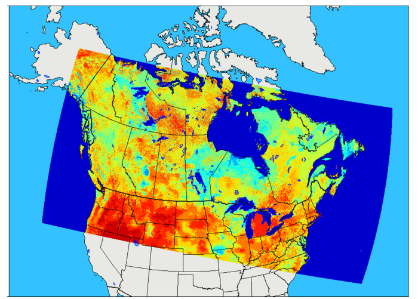

## **Canadian Land Data Assimilation System based on Satellite data (CaLDAS-Sat)**

### **Overview**

CaLDAS is a land surface data assimilation system, which uses ancillary datasets, atmospheric forcings and various other types of observations to produce land surface analyses for numerical weather prediction systems (i.e. HRDPS). The purpose of CaLDAS-Sat is to ingest both satellite and ground-based observations, 
while using land surface modelling and data assimilation techniques to generate optimal land surface states and fluxes. CaLDAS-Sat provides analyses of near-surface, surface, and sub-subsurface variables such as snow depth, 2-m atmospheric temperature, skin (land surface)
temperature and soil moisture over most of Canada at a 2.5-km resolution. Analyses from CaLDAS-Sat are constructed by assimilating observations for these variables, but relys on satellite data for soil moisture retrievals and snow cover extent. The land-surface scheme used by CaLDAS-Sat is Soil, Vegetation, and Snow (SVS). 
Currenlty, CaLDAS-Sat provides soil moisture conditions for both <a href = "../../HRDLPS/HRDLPS-2.0"> HRDLPS </a> and <a href = "../../DHPS/DHPS-3.1.0"> DHPS </a>
 
  
<b>Learn more about land surface data assimilation systems here :</b>

** Current version: ** 2.1.3
 
<!-- ** Past versions: **

* [x.x](./previous_versions/old_version.md)
* [x.x](./previous_versions/old_version.md) -->

### **What is the spatial resolution and coverage of this data?**

 
CaLDAS-Sat is currently implemented at 2.5 km grid covering most of Canada, and is identical to HRDPS. 

### **What is available?**

What is the timestep and time period covered by this data? 

 
CaLDAS-Sat uses 0-6 h HRDPS atmospheric forcing four times daily (00, 08, 12, 18 UTC), and produces an analysis every three hours (00, 03, 06, 09, 12, 15, 18, 21 UTC). 

 

What are the outputs from this product? 

<h5> Relevant outputs from CaLDAS-Sat include: </h5>
<ul>
<li>Soil moisture</li>
<li>Surface temperatures: bare ground, vegetation, and snow</li>
<li>Snow depth: bare ground, high and low vegetation</li>
<li>Air, surface, and skin temperatures</li>
</ul>
<h5>Outputs currently available via NetCDF</h5>

	<table>
		<thead>
			<tr>
				<th>Variable </th>
				<th>Variable long name</th>
				<th>Unit </th>
				<th>Level </th>
			</tr>
		</thead>
		<tbody>
			<tr>
				<td>TD </td>
				<td>1.5-m dew point temperature</td>
				<td>K</td>
				<td>1.5 m (above ground level)</td>
			</tr>
			<tr>
				<td>TG </td>
				<td>surface temperature</td>
				<td>K</td>
				<td>Surface</td>
			</tr>
			<tr>
				<td>TT </td>
				<td>1.5-m air temperature</td>
				<td>K</td>
				<td>1.5 m (above ground level)</td>
			</tr>
			<tr>
				<td>WSOL </td>
				<td>volumetric water content of soil</td>
				<td>m3 m-3</td>
				<td> 0.025, 0.075, 0.15, 0.3, 0.7, 1.5, 2.5 m(depth below surface)</td>
			</tr>
		</tbody>
	</table>

How do I access the data? 

 

 <i> Currently CaLDAS-Sat data is only available through ECCC's internal Science Network.</i> 

What is the file structure and format?

 
<i> Currently DHPS data is available in NetCDF file format, click   <a href = "../../../data_access/file_formats/file_formats">  here  </a>  information on file formats  </i>
 
 
<h4> <i>.tar</i> package for each run contains the following: </h4>
<ul>
<li><code>TD_AGL</code> Contains the dew point temperature at 1.5 m above ground level. </li>
<li><code>TG_SFC</code> Contains the surface temperature. </li>
<li><code>TT_AGL</code> Contains the surface temperature at 1.5 m above ground level.</li>
<li><code>WSOL_DBS</code> Contains the volumetric water content of soil at 7 depths below surface (0.025, 0.075, 0.15, 0.3, 0.7, 1.5, 2.5 m ).</li>
</ul>

 What is the status of this product? 

 
<b>Current Status</b>: Operational
 

 click   <a href = "../../../additional_information/operational-statuses/operational-status">  here  </a>  for descriptions of various operational statuses 

### **Where can I find additional information?**
** [Technical note](documentation/Tech_note_dhps_v310_e_Final_20210915.pdf) **
 
** [Specifications](./) **
 
** [Change log](../Status_definitions/status.md) **

### **License**

The [End-User Licence for Environment and Climate Change Canada's Data Servers](../../license/license.md) specifies the conditions of use of this data.
