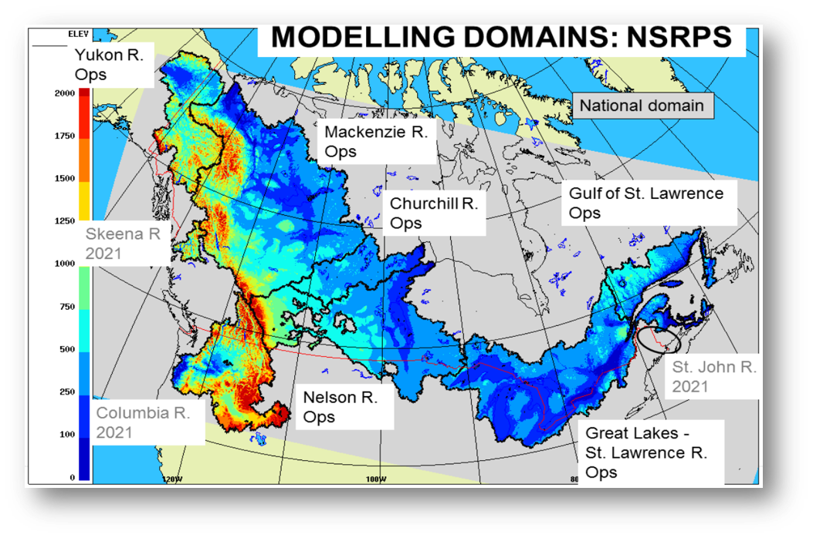

## **Deterministic Hydrologic Prediction System (DHPS)**

### **Overview**

DHPS is a river routing system that is part of Environment Canada's GEM-Hydro forecasting system,
and is the river routing component of NSRPS. DHPS performs the routing of liquid water leaving the surface
model (SPS), which is then conveyed in streams and lakes throughout the modelling domain. DHPS only routes water generated by the surface model, and generally
does not add or remove water to or from the outputs of the surface model. 

 

DHPS both analyses and forecasts, routing water from CaLDAS-Sat and HRDLPS, respectively, through a river basin’s lakes and 
rivers at a 1-km grid resolution. It simulates lake levels for defined lakes or reservoirs and streamflow for all other points 
throughout the domain.   

 

DHPS is based on the Watroute routing scheme, and has the ability to represent reservoirs with a natural behavior as well as flow diversions.
DHPS also assimilates streamflow observations during the data assimilation cycle. Currently, DHPS  assimilates 
observations from ECCC’s Water Survey of Canada, USGS, and the provincial networks of river gauges in Quebec and Alberta.

 

** Current version: ** 3.1.0
 
** Past versions: **

* [x.x](./previous_versions/old_version.md)
* [x.x](./previous_versions/old_version.md)

## **What is the spatial resolution and coverage of this data?**

 
Outputs from DHPS are currently implemented at a 1-km resolution over six major river basins representing ~50% of Canada.

DHPS is currently established in the following basins: 
<ul>
<li> Yukon River Basin </li>
<li> Mackenzie River Basin </li>
<li> Nelson River Basin  </li>
<li> Churchill River Basin </li>
<li> Great Lakes and St. Lawrence River Basin </li>
</ul> 

DHPS also estimates the water budget of large specified water bodies, which include:
<li> The five Laurentian Great Lakes </li>
<li> Lake Champlain </li>
<li> Lake Athabasca  </li>
<li> Great Slave Lake </li>
<li> Great Bear Lake </li>

## **What is the timestep and time period covered by this data?**

Twice a day, launching at 00 and 12 UTC, DHPS performs a 12-h data assimilation cycle followed by a 6-day forecast 

## **What are the outputs from this product?**

Outputs 

DHPS produces analyses in near real-time and forecasts over the next six days. From the analyses and forecasts, DHPS
provides hourly estimates of:
<li> River discharge and;</li>
<li> The volume of water stored in the river channel or at the outlet of an explicitly represented natural lake or regulated reservoir </li>
 
DHPS also provides analyses and forecasts of some variables  averaged 
over the surface of specified large lakes (listed above) during successive 12-hour periods:
<li>precipitation </li>
<li>Evaporation </li>
<li>Terrestrial runoff </li>

## **How do I access the data?**

*Currently DHPS data is only available through ECCC's internal Science Network.*

### **License**

The [End-User Licence for Environment and Climate Change Canada's Data Servers](../../license/license.md) specifies the conditions of use of this data.

## **What is the status of this product?** 

**Current Status**: Experimental
 
*click [here](../Status_definitions/status.md) for descriptions of different operational statuses*
 

## **Where can I find additional information?**

** [Technical note](documentation/Tech_note_dhps_v310_e_Final_20210915.pdf) **
 
** [Specifications](./) **
 
** [Change log](../Status_definitions/status.md) **

### **License**

The [End-User Licence for Environment and Climate Change Canada's Data Servers](../../license/license.md) specifies the conditions of use of this data.
