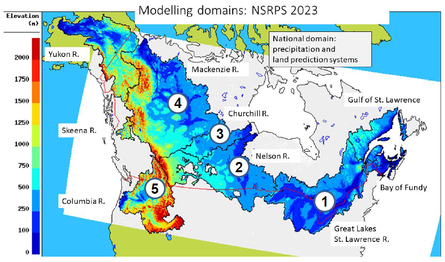

## **National Surface and River Prediction System (NSRPS)**

### **Overview**

 NSRPS is a Complete hydro-meteorological prediction system, which aims to provide the best possible representation of the current 
and future states of the land surface, as well as the movement of water over and through the soil column and through the lake and river networks. NSRPS is an integrated chain of numerical prediction systems, driven by high-resolution atmospheric forcing fields from the 
High Resolution Deterministic Prediction System (HRDPS). The component systems of NSRPS include: 

<ul>
<li> <a href = "../../HREPA/HREPA-1.3.0"> High Resolution Ensemble Precipitation Analysis (HREPA) </a>
<li> <a href = "../../HRDLPS/HRDLPS-2.0"> High Resolution Deterministic Prediction System (HRDLPS) </a>
<li> <a href = "../../CALDAS-SAT/CALDAS-SAT-2.1.3">Canadian Land Data Assimilation System (CaLDAS-Sat) </a>
<li> <a href = "../../DHPS/DHPS-3.1.0"> Deterministic Hydrological Prediction System (DHPS) </a>
<li> <a href = "../../../coming-soon"> Simulation Hydrodynamique Opérationnel (SHOP) </a>
</ul>

** Current version: ** 3.1.0
 
** Past versions: **
<!-- 
* [1.0](./path/to/old_version.md)
* [2.0](../../license/license.md)
 -->

### **What is the spatial resolution and coverage of this data?**

Discharge outputs from NSPRS are currently implemented at a 1-km resolution over six major river basins representing ~50% of Canada.
As NSRPS is composed of different sub-systems, both the domain and spatial resolution vary based on the which sub-system the output is derived. 

NSRPS is currently established in the following basins: 
<ul>
<li> Yukon River Basin </li>
<li> Mackenzie River Basin </li>
<li> Nelson River Basin  </li>
<li> Churchill River Basin </li>
<li> Great Lakes and St. Lawrence River Basin </li>
</ul> 

 
### **What is available?**
 

What is the timestep and time period covered by this data? 

 
Twice a day, launching at 00 and 12 UTC, DHPS performs a 12-h data assimilation cycle followed by a 6-day forecast

 

 

What are the outputs from this product? 

<h5>Outputs</h5>

	<table>
		<thead>
			<tr>
				<th>Variable </th>
				<th>Variable long name</th>
				<th>Unit </th>
				<th>Level </th>
			</tr>
		</thead>
		<tbody>
			<tr>
				<td>Discharge (disc) </td>
				<td>Mean discharge value exiting the river channel over the hour ending at the indicated time</td>
				<td>m**3/s</td>
				<td>Surface</td>
			</tr>
		</tbody>
	</table>

How do I access the data? 

 

 <i> Currently DHPS data is only available through ECCC's internal Science Network.</i> 

 What is the status of this product? 

 
<b>Current Status</b>: Operational
 

 click  <a href = "../../../additional_information/operational-statuses/operational-status">  here  </a>  for descriptions of various operational statuses 

 
### **Where can I find additional information?**

** [Technical note](documentation/Tech_note_dhps_v310_e_Final_20210915.pdf) **
 
** [Specifications](./) **
 
** [Change log](../Status_definitions/status.md) **

### **License**

The [End-User Licence for Environment and Climate Change Canada's Data Servers](../../license/license.md) specifies the conditions of use of this data.

