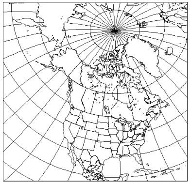

## **Regional Deterministic Precipitation Analysis System (CaPA-RDPA)** 

### **Overview**

CaPA-RDPA is a regional deterministic precipitation analysis system that provides objective estimates of precipitation amount
over the North American domain by merging records from precipitation sensors, radar QPEs, IMERG QPEs and a trial field generated from 
a numerical weather prediction system (RDRS). 

** Current version: ** 5.2.0
 
<!-- ** Past versions: **

* [x.x](./previous_versions/old_version.md)
* [x.x](./previous_versions/old_version.md)
 -->

### **What is the spatial resolution and coverage of this data?**

RDPA covers continental North America, and has a spatial resolution of 10-km.

<!--  -->

  <button id="play" class="btn btn-primary btn-sm" type="button"><i class="fa fa-play" style="padding: 0rem 1rem"></i></button>
  <button id="pause" class="btn btn-primary btn-sm" type="button"><i class="fa fa-pause" style="padding: 0rem 1rem"></i></button>
  

 

### **What is available?**

What is the timestep and time period covered by this data? 

 

 
HRDPA produces four sets of cumulative precipitation analyses (6-hour amounts per day) valid at synoptic hours (00, 06, 12, and 18Z) each day.
HRDPA also produces two 24-hour precipitation amounts in step with the climatological day valid at 06 and 12 UTC. 

A 'preliminary' analysis is completed 1 hour after the time of validity and another called 'final' is produced 7 hours later, which results in a total of 8 analyses for a day. 

 

What are the outputs from this product? 

<h5>Outputs currently available</h5>

	<table>
		<thead>
			<tr>
				<th>Variable </th>
				<th>Variable long name</th>
				<th>Unit </th>
				<th>Level </th>
				<th>Frequency  </th>
			</tr>
		</thead>
		<tbody>
			<tr>
				<td>PR</td>
				<td>Total precipitation </td>
				<td>kg/m2</td>
				<td>surface</td>
				<td>6h/24hr</td>
			</tr>
			<tr>
				<td>CFIA</td>
				<td> Confidence Index of the Analysis</td>
				<td>-</td>
				<td>-</td>
				<td>6h</td>
			</tr>
	</table>
The field CFIA gives the weight of observations in the analysis value at grid points. Its value falls in a range from 0 to 1. 
A value of 0 means that no observation has contributed to the value of the analysis, while a value 
close to 1 means that the weight of neighboring observations is high. More confidence is placed on the analysis value where CFIA is high. 

How do I access the data? 

 

 
There are multiple ways to access RDPA. Currently, it is available on both <a href = "https://dd.weather.gc.ca/">  MSC Datamart </a> and <a href = "https://eccc-msc.github.io/open-data/msc-geomet/readme_en/">  MSC GeoMet </a>. 
 
 
The data can also be accessed on the  <a href = "https://caspar-data.ca/">  Canadian Surface Prediction Archive (CaSPAr)  </a>, 
which is an archive of numerical weather predictions issued by Environment and Climate Change Canada.

What is the file structure and format?

 
<i> Currently RDPA data is available in GRIB2 file format, click   <a href = "../../../data_access/file_formats/file_formats">  here  </a>  information on file formats </i>
 
<h5> RPDA GRIB2 files follow the following naming convention: </h5>
 
<code> ORGANIZATION_PRODUCT_VARIABLE_OBSERVATIONCUTOFFTIME_LEVEL_GRID_YYYYMMDDHH_000 </code>

<table>
	<thead>
		<tr>
			<th> String </th>
			<th> Description </th>
		</tr>
	</thead>
	<tbody>
		<tr>
			<td><b> ORGANIZATION </b></td>
			<td> Refers to the group that creates the files  </td>
		</tr>
		<tr>
			<td><b> DATASET</b></td>
			<td> Refers to the model. </td>
		</tr>
		<tr>
			<td><b> VARIABLE </b></td>
			<td> Refers to the variable of the analysis. For HRDPA, ACPC refers to the PR (precipitation) </td>
		</tr>
		<tr>
			<td><b> Observation cut-off time </b></td>
			<td> <b>0100cutoff: </b>Observation cut-off time is one hour after the time YYYYMMDDHH indicating that possibly not all observations have been collected
			 
			<b> 0700cutoff:</b> Observation cut-off time is about 007 hours after the time YYYYMMDDHH indicating that a maximum of observations has likely been collected</td>
		</tr>
		<tr>
			<td><b> GRID </b></td>
			<td>Refers to the vertical coordinate (pressure level, surface, sub-surface, etc.). sfc = Surface</td>
		</tr>
		<tr>
			<td><b> YYYYMMDDHH </b></td>
			<td> The issue date and time </td>
		</tr>
		<tr>
			<td><b> 000 </b></td>
			<td> Would normally refer to the forecast hour, but is not applicable as this product is an analysis  </td>
		</tr>
	</table>

 What is the status of this product? 

 
<b>Current Status</b>: operational
 

 click  <a href = "../../../additional_information/Operational-statuses/operational-status">  here  </a>  for descriptions of various operational statuses 

	<table>
		<thead>
			<tr>
				<th>Run type </th>
				<th>Valid dates</th>
				<th>Product type </th>
				<th>Comment </th>
			</tr>
		</thead>
		<tbody>
			<tr>
				<td>Operational </td>
				<td> 2021/12/01 to Present</td>
				<td>Analysis</td>
				<td> Fully operational IC3 product suite</td>
			</tr>
			<tr>
				<td>Parallel </td>
				<td> 2021/07/05 to 2021/12/01</td>
				<td>Analysis</td>
				<td> Suite ran in parallel</td>
			</tr>
	</table>

### **Where can I find additional information?**

<b> <a href = https://collaboration.cmc.ec.gc.ca/cmc/CMOI/product_guide/docs/tech_notes/technote_capa_rdpa-520_e.pdf> Technical Note </a></b>
 
<b> <a href = https://collaboration.cmc.ec.gc.ca/cmc/CMOI/product_guide/docs/tech_specifications/tech_specifications_RDPA_5.2.0_e.pdf > Technical Specifications </a></b>
 
** [Change log](./path/to/doc) **

### **Product license**

The [End-User Licence for Environment and Climate Change Canada's Data Servers](../../license/license.md) specifies the conditions of use of this data.

<!-- Map scripts  -->
<link rel="stylesheet" href="https://cdnjs.cloudflare.com/ajax/libs/openlayers/4.6.5/ol.css" integrity="sha256-rQq4Fxpq3LlPQ8yP11i6Z2lAo82b6ACDgd35CKyNEBw=" crossorigin="anonymous" />

